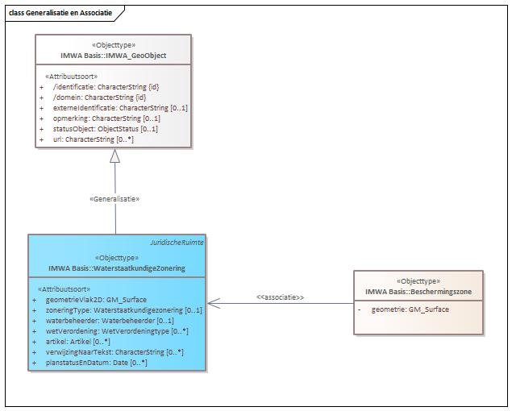

# Gegevensdefinitie en modelelementen

## Gegevensdefinitie

De gegevensdefinitie is het belangrijkste deel van de catalogus. Hierin staat een beschrijving van alle gegevens in een informatiemodel.  

Eerst wordt het *domein* gedefinieerd, vaak met een afbeelding van het *domeinmodel*. Daarna worden de *entiteiten* beschreven. Dit zijn de onderdelen van het domein. Van elke entiteit worden de kenmerken (*attributen*) en de relaties met andere entiteiten vastgelegd.  

De volgende informatie over de gegevens wordt opgeslagen:

- De Nederlandse naam van het gegeven.
- Of het een *entiteit* of een *attribuut* is. Als het een attribuut is, wordt ook aangegeven bij welke entiteit het hoort.
- Waar het gegeven vandaan komt (herkomst), indien van toepassing.
- De betekenis (definitie) van het gegeven.
- Waar de definitie vandaan komt (herkomst), indien van toepassing.
- Hoe vaak het attribuut voorkomt (*kardinaliteit*). Dit geeft aan of het attribuut verplicht is en hoeveel keer het mag voorkomen.
- De naam van het domein waarin de waarden van het attribuut zich bevinden. Soms wordt extra informatie gegeven over de mogelijke waarden.

## Modelelementen

Modelelementen zijn de bouwstenen van een informatiemodel. Ze bepalen de structuur en werking van het model. Elk element heeft een specifieke functie in de organisatie en het beheer van data.  

Elk informatiemodel heeft een aantal vaste elementen. Door deze elementen goed te begrijpen, wordt het model en de catalogus makkelijker te lezen.

### Objecten

- **Object**  
  Een object is een belangrijk element in het model. Afhankelijk van het perspectief kan een object verschillende namen hebben, zoals *informatieobject*, *objecttype* (MIM), *entiteit* of *klasse* (UML). Hoewel deze termen iets kunnen verschillen, betekenen ze in de basis hetzelfde: een groep van eigenschappen die samen een betekenis vormen. Elk object heeft een naam en een definitie. In het model worden objecten aangeduid als *Objecttype*.

- **Attribuut**  
  Een attribuut is een eigenschap of kenmerk van een object. In het model wordt dit aangeduid als een *Attribuutsoort*.

- **Gegevensgroepen**  
  Soms worden meerdere attributen gegroepeerd in een *gegevensgroep*. De attributen in zo’n groep horen inhoudelijk bij elkaar en worden als een geheel behandeld.  
  Gegevensgroepen kunnen bij meerdere entiteiten voorkomen. Een voorbeeld hiervan is een groep *afmetingen*, waarin de attributen *lengte*, *breedte* en *hoogte* zitten.

### Relaties tussen objecten

Objecten kunnen aan elkaar gekoppeld zijn via relaties. Een relatie heeft altijd een richting. In de meeste gevallen loopt deze van een *bron* naar een *doel*.  

De meest voorkomende relatie in IMWA is de *generalisatie*. Soms komt ook een *associatierelatie* voor.

  
*Voorbeeld van generalisatie- en associatierelatie.*

- **Generalisatierelatie**  
  Een generalisatierelatie geeft aan dat een object afgeleid is van een ander object. Dit betekent dat de eigenschappen van het ene object ook gelden voor het andere object. Dit wordt een *'is-een'-relatie* genoemd.  

- **Overerving**  
  Overerving betekent dat een object eigenschappen erft van een ander object. In het voorbeeld erft *WaterstaatkundigeZonering* alle eigenschappen van *IMWA-GeoObject*. Het verschil is dat *WaterstaatkundigeZonering* extra eigenschappen heeft.

- **Abstract object**  
  Een abstract object is een object dat niet als zelfstandig element voorkomt in de echte wereld. Het wordt gebruikt als sjabloon voor andere objecten. In het model krijgen abstracte objecten vaak een samengestelde naam die cursief wordt weergegeven.

- **Associatierelatie**  
  Een associatierelatie beschrijft een *heeft-een*-relatie tussen twee objecten. Deze relatie geeft aan dat de objecten samenwerken, maar niet per se een hiërarchische relatie hebben.  
  In associatierelaties speelt *kardinaliteit* een rol. Kardinaliteit geeft aan hoeveel objecten met elkaar verbonden zijn. Dit wordt weergegeven in de notatie `n..m`. Als er geen kardinaliteit staat, wordt aangenomen dat deze `1..1` is.

### Domeinen en datatypen

Bij elk object staan de bijbehorende attributen. Achter elk attribuut staat het *datatype* of de naam van het *domein* waartoe het attribuut behoort.  
De *kardinaliteit* wordt aangegeven als het attribuut niet verplicht is of vaker dan één keer voorkomt.

#### Datatypen

Een datatype bepaalt wat voor soort waarde een attribuut kan hebben.  

Enkele eenvoudige datatypes zijn:

- `number` (getal)
- `integer` (geheel getal)
- `characterstring` (tekst)
- `date` (datum)
- `year` (jaar)

Deze typen worden de *primitieve datatypen* genoemd in MIM. Sommige datatypen zijn complexer en bestaan uit meerdere delen.

- **Measure**  
  Het datatype *Measure* bestaat uit twee delen: een getal en een eenheid. Bijvoorbeeld: een lengte van *10 meter*. In de huidige versie van het informatiemodel zijn de exacte opbouw en het bereik van de waarden nog niet gespecificeerd.

- **Geometrie**  
  Geometrie-attributen beschrijven de vorm en locatie van objecten. IMWA gebruikt de geometrie-typen uit de OpenGIS Specificatie. De meest voorkomende is *GM_Object*, wat verschillende vormen kan aannemen, zoals een *punt*, *lijn* of *vlak*.

#### Domeinen

Een *domein* is een verzameling waarden die een attribuut kan aannemen. Soms kan een domein worden uitgebreid met nieuwe waarden.  

Bij een uitbreidbare waardelijst wordt de naam van de lijst vermeld. De volledige inhoud van de lijst staat in een apart hoofdstuk van de gegevensdefinitie.
